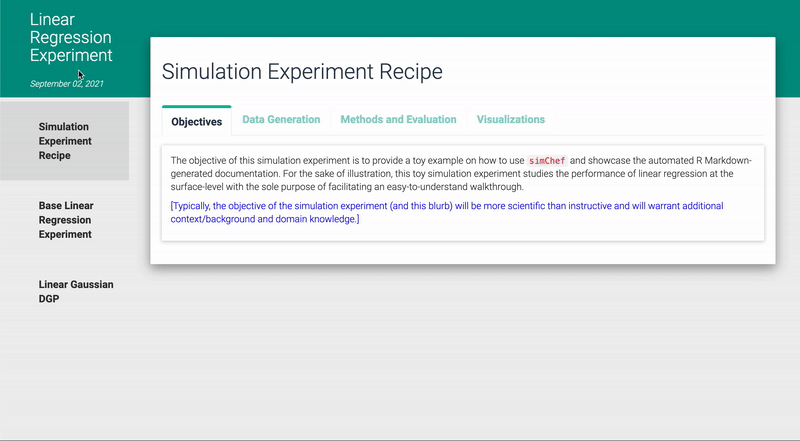

```{r xariganExtra, echo=FALSE}
xaringanExtra::use_extra_styles(
  hover_code_line = TRUE,
  mute_unhighlighted_code = TRUE
)
```

# 

`simChef` is a powerful framework for designing, documenting, and deploying simulation experiments in R.

**Goals:**

- Provide an intuitive grammar of simulation experiments.
- Reduce the startup time and boilerplate code needed to create simulations.
- Provide a standard and interactive way to document and visualize simulation results.
- Support small simulations on a laptop or large ones on a cluster.

# Simulation abstractions

- **Experiment**: a collection of related simulation scenarios.
- **DGP**: Data-generating process, which define the "ground truth" to generate simulation data flexibly.
- **Method**: The main objects of study in the simulation, along with baselines.
- **Evaluator**: Produce meaningful summaries and statistics of the results.
- **Visualizer**: Outputs plots, tables, R Markdown, latex, etc. to populate interactive experiment documentation.

# Grammar of simulations

```{r, eval=FALSE}
experiment <- create_experiment() %>%
  add_dgp(dgp1) %>%
  add_dgp(dgp2) %>%
  add_method(method1) %>%
  add_vary_across(
    dgp = dgp1,
    n = c(100, 1000, 10000)
  ) %>%
  add_vary_across(
    method = method1,
    lambda = c(0.1, 0.5, 1.0)
  )

results <- experiment %>%
  run_experiment()
```

# Interactive documentation



# Parallelization

## TODO: add simChef logo + future
<p class="future-right">

```{r, eval=FALSE}
library(future)
n_workers <- availableCores()
plan(multisession, workers = n_workers)

results <- experiment %>%
  run_experiment(n_reps = 200,
                 save = TRUE)
```
```
Fitting empirical-fdr-comparison...
Saving fit results...
Fit results saved | time taken: 0.252786 seconds
200 reps completed (totals: 200/200) | time taken: 17.675338 minutes
==============================
```

Other helpful features:

- Simulation checkpointing every $N$ replicates
- Only compute new parts when adding DGPs / Methods / parameters / additional reps
- Recover partial results and inspect errors when one part of the experiment fails

# Roadmap

- Nested parallelism
- A sibling package library of flexible and modular DGPs
- Ongoing usability improvements
- Submit issues and feature requests [on GitHub](https://github.com/Yu-Group/simChef/issues)!

# Test {.no-block .test}

This section doesn't have the poster block styling.
